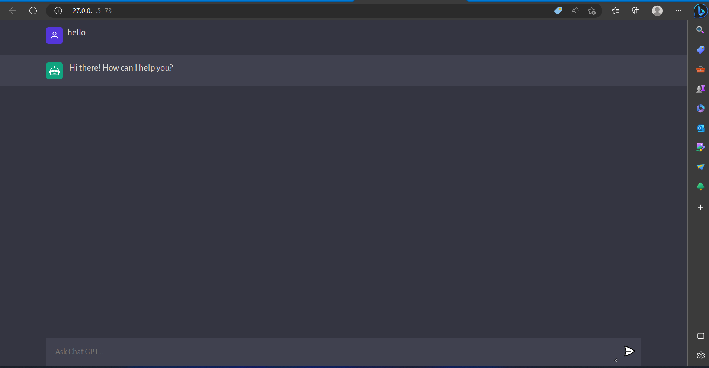

# Chat GPT Clone using Vite App

<p align="center">
  <a href="" rel="noopener">
 </a>
</p>

<h3 align="center">Chat GPT Clone-App</h3>

<div align="center">

  []() 
  [](https://github.com/kylelobo/The-Documentation-Compendium/issues)
  [](https://github.com/kylelobo/The-Documentation-Compendium/pulls)
  [](/LICENSE)

</div>

---

<p align="center"> This project is a chatbot that uses natural language processing (NLP) and artificial intelligence (AI) to provide users with an interactive, personalized experience. The chatbot is designed to understand user input and respond in a meaningful way, allowing users to ask questions and receive answers in real-time. The chatbot can also provide helpful advice and recommendations based on the user's input. This project will help make conversations more efficient and enjoyable for both parties involved.
    <br> 
</p>

## 📝 Table of Contents
- [About](#about)
- [Getting Started](#getting_started)
- [Deployment](#deployment)
- [Usage](#usage)
- [Built Using](#built_using)
- [TODO](../TODO.md)
- [Contributing](../CONTRIBUTING.md)
- [Authors](#authors)
- [Acknowledgments](#acknowledgement)

## 🧐 About <a name = "about"></a>
- Chatbots are becoming increasingly popular as a way to provide customer service and support. They are computer programs that use artificial intelligence to simulate conversations with people in order to answer their questions or provide assistance. Chatbots can be used in a variety of ways, from providing customer service on websites and social media platforms, to helping customers find the right product or service.
- Chatbot technology is rapidly evolving, and developers are finding new ways to make them more useful and efficient. For example, some chatbots are now able to understand natural language processing (NLP) so they can better understand what people are saying. Additionally, developers are creating chatbots that can integrate with other services such as calendars and email accounts so they can provide more personalized experiences for users. As chatbot technology continues to improve, it will become an even more valuable tool for businesses looking to provide better customer service and support

## 🏁 Getting Started <a name = "getting_started"></a>
```
   1. Download the project zip file from Github repository
   2. unzip the file 
   3. open in your editor (vs code)
   4. open the terminal and run the `npm start` 
   5. change derectory to client file 
   6. 'npm run dev' - run vite app
   7. server setup split the terminal and change the directory 
   server 
   8. Run the command ' npm run server '
   9. NOW the application run 
   10. test the application.

```

### Prerequisites
```
1. download visual studio code editor 

2. open ai - API Keys

3. vite application install

4. vanilla template 

4. npm install

```

### Installing


```
vite-app install in terminal 
  1. using command - npm create vite@latest client --template vanilla 

  2. Then select vanilla javascript frame work

  

```

And repeat

```
  1. Change directory to cilent folder, then install npm 'npm install'

  2. npm run dev 
```
server side
```
  1. Change directory to server folder, then Run

  2. npm run server

```


## 🔧 Running the tests <a name = "tests"></a>
- The Fetch API is a web standard that allows you to make network requests from the browser. It is an interface for fetching resources, such as an AI API. To use the Fetch API, you need to create a request object with the URL of the AI API endpoint and any other parameters you want to include in the request. You can then use the fetch() method to send the request and receive a response from the server. The response will contain data from the AI API, which you can then use in your application.

### Break down into end to end tests
The chatbot is designed to understand user input and respond in a meaningful way, allowing users to ask questions and receive answers in real-time. The chatbot can also provide helpful advice and recommendations based on the user's input. This project will help make conversations more efficient and enjoyable for both parties involved.


</a>


```
Any type of question you can ask 
```

## 🎈 Usage <a name="usage"></a>
- ChatGPT uses natural language processing (NLP) to understand user input and generate appropriate responses. It uses machine learning algorithms to learn from conversations and generate more accurate responses over time. The system can also be trained with custom data sets to better understand specific topics or domains.

- ChatGPT uses natural language processing (NLP) to understand user input and generate appropriate responses. It uses machine learning algorithms to learn from conversations and generate more accurate responses over time. The system can also be trained with custom data sets to better understand specific topics or domains.

- ChatGPT can help automate customer service tasks, such as answering FAQs, providing product information, and helping customers complete transactions quickly and accurately. It can also be used for more complex tasks such as providing personalized recommendations or helping customers troubleshoot technical issues. Additionally, it can reduce costs associated with customer service operations by reducing the need for human agents.

## 🚀 Deployment <a name = "deployment"></a>

   1. Download the project zip file from Github repository
   2. unzip the file 
   3. open in your editor (vs code)
   4. open the terminal and run the `npm start` 
   5. change derectory to client file 
   6. `npm run dev` - run vite app
   7. server setup split the terminal and change the directory 
   server 
   8. Run the command ` npm run server `
   9. NOW the application run 
   10. test the application.


## ⛏️ Built Using <a name = "built_using"></a>
- [vs code](https://www.mongodb.com/) - visual studio code
- [vanilla js](https://www.npmjs.com/package/vanilla-lazyload) - Framework
- [vite js](https://vitejs.dev/guide/) - npm library javascript  
- [NodeJs](https://nodejs.org/en/) - Server Environment

## ✍️ Authors <a name = "authors"></a>
- [poontamilzhan k](https://github.com/POONTAMILZHAN/ChatGPT_Clone) - Idea & Initial work


## 🎉 Acknowledgements <a name = "acknowledgement"></a>
- youtube reference based learn this projects
- OpenAI platform 
